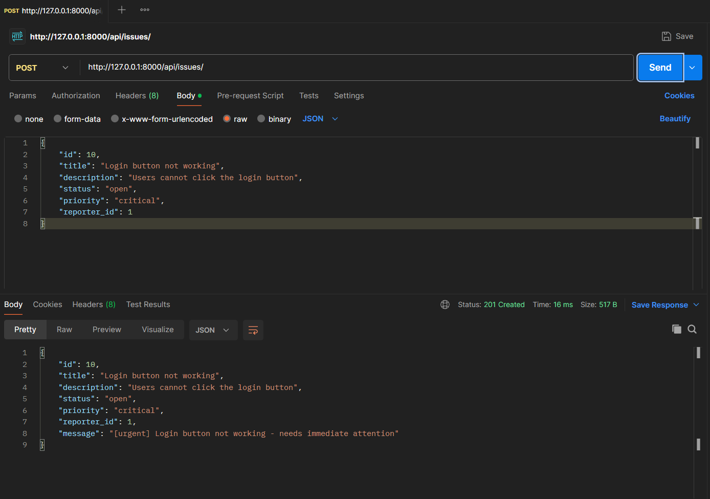
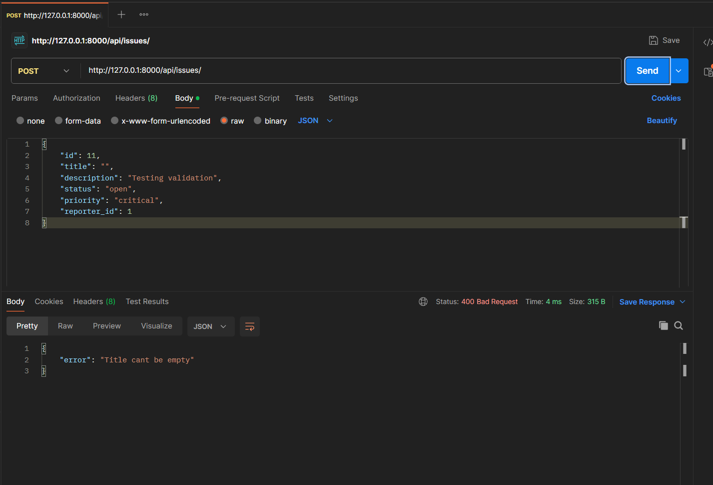

# DevTrack

DevTrack is a minimal Django backend API for tracking engineering issues. It allows engineers to create reporters, create and manage issues, assign priorities, and track issue status.

## Tech Stack

* Python 3
* Django
* JSON file storage
* Postman for API testing

## Project Structure

```text
devtrack-project/
├── devtrack/
│   ├── settings.py
│   └── urls.py
├── issues/
│   ├── models.py
│   ├── views.py
│   └── urls.py
├── issues.json
├── reporters.json
├── manage.py
└── README.md
```

## How to Run

### 1. Clone the repository

```bash
git clone <your-github-repository-url>
cd devtrack-project
```

### 2. Create and activate the virtual environment

Windows PowerShell:

```powershell
python -m venv venv
.\venv\Scripts\Activate.ps1
```

### 3. Install Django

```powershell
pip install django
```

### 4. Apply migrations

```powershell
python manage.py migrate
```

### 5. Start the development server

```powershell
python manage.py runserver
```

The API will be available at:

```text
http://127.0.0.1:8000/
```

## API Endpoints

### Reporter Endpoints

| Method | Endpoint               | Description           |
| ------ | ---------------------- | --------------------- |
| POST   | `/api/reporters/`      | Create a new reporter |
| GET    | `/api/reporters/`      | Get all reporters     |
| GET    | `/api/reporters/?id=1` | Get a reporter by ID  |

### Issue Endpoints

| Method | Endpoint                   | Description                   |
| ------ | -------------------------- | ----------------------------- |
| POST   | `/api/issues/`             | Create a new issue            |
| GET    | `/api/issues/`             | Get all issues                |
| GET    | `/api/issues/?id=1`        | Get an issue by ID            |
| GET    | `/api/issues/?status=open` | Get issues filtered by status |

## Issue Status

The following statuses are supported:

* `open`
* `in_progress`
* `resolved`
* `closed`

## Issue Priority

The following priorities are supported:

* `low`
* `medium`
* `high`
* `critical`

## OOP Design

The project uses object-oriented programming concepts in `issues/models.py`.

`BaseEntity` is an abstract base class shared by both `Reporter` and `Issue`. It provides the abstract `validate()` method and a shared `to_dict()` method.

`CriticalIssue` and `LowPriorityIssue` inherit from `Issue` and override the `describe()` method.

The API selects the appropriate class based on issue priority:

* `critical` → `CriticalIssue`
* `low` → `LowPriorityIssue`
* `medium` / `high` → `Issue`

The POST issue response includes the result of `describe()` as the `message` field.

## Design Decision

JSON files were used for data storage instead of a database because the assignment specifically requires `issues.json` and `reporters.json`. This keeps the implementation simple while allowing the OOP and API concepts to be demonstrated clearly.

## Postman Testing

### Successful Issue Creation

The Issue POST endpoint returns `201 Created` for a valid request and includes the polymorphic `message` response.



### Validation Failure

The Issue POST endpoint returns `400 Bad Request` when validation fails, such as when the issue title is empty.


